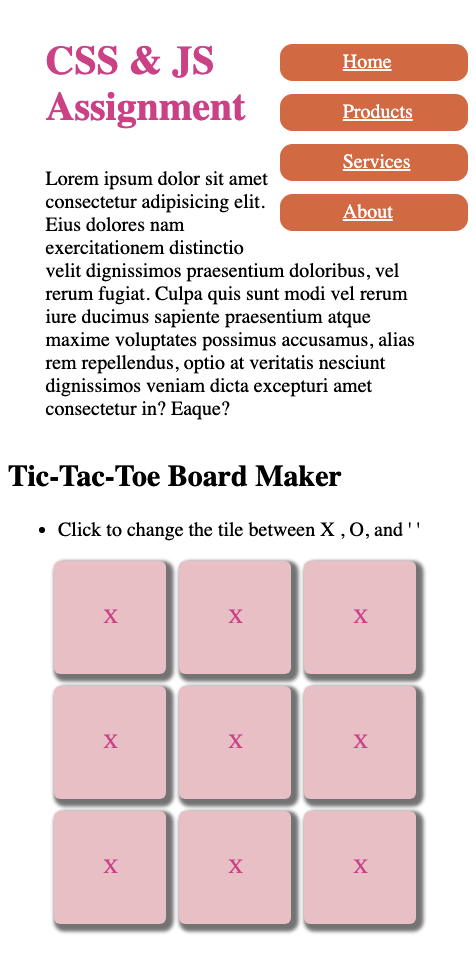
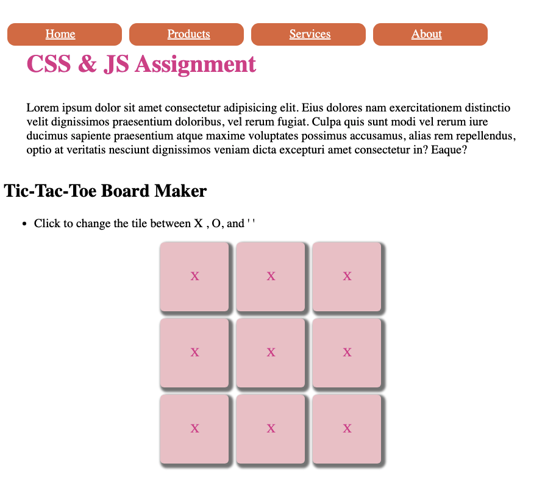
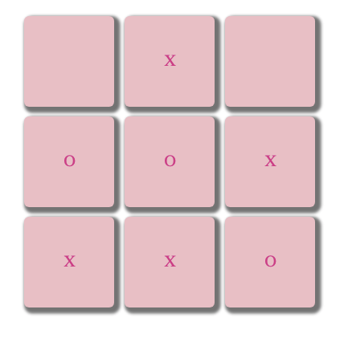

Assignment #2+3

Try to recreate the webpage as show here.
When the width is less than 600px,
the web shall look similar to this:

Other wise, it shall look like this:

The user clicks anywhere inside the tile
(the pink area or exactly on the letter),
the letter inside shall change from X->O->''.

Note: In CSS, avoid using id and inline element.

Hint:
In JavaScript, when you search and get a return element,
you can do the search again on that element.

Ex:
let myContainer = docuemtn.querySelector(".container");
// Now, we can search again for 
 inside the returned element.
let pElem = myContainer.querySelector("p");
